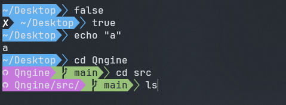

# Git bash for windows powerline theme

Light & simple powerline theme for Git bash for windows.  
This is a fork of the original repository. I can be found [here](https://github.com/diesire/git_bash_windows_powerline).
  



## Install:

I recommend the following:

```bash
cd $HOME
mkdir -p .bash/themes/git_bash_windows_powerline
git clone https://github.com/QwertyR0/git_bash_windows_powerline.git .bash/themes/git_bash_windows_powerline
```

then add the following to your .bashrc:

```bash
# Theme
THEME=$HOME/.bash/themes/git_bash_windows_powerline/theme.bash
if [ -f $THEME ]; then
   . $THEME
fi
unset THEME
```

## Requisites

* In order for this theme to render correctly, you will need a
[Powerline-patched font](https://github.com/powerline/fonts).

## License

MIT
